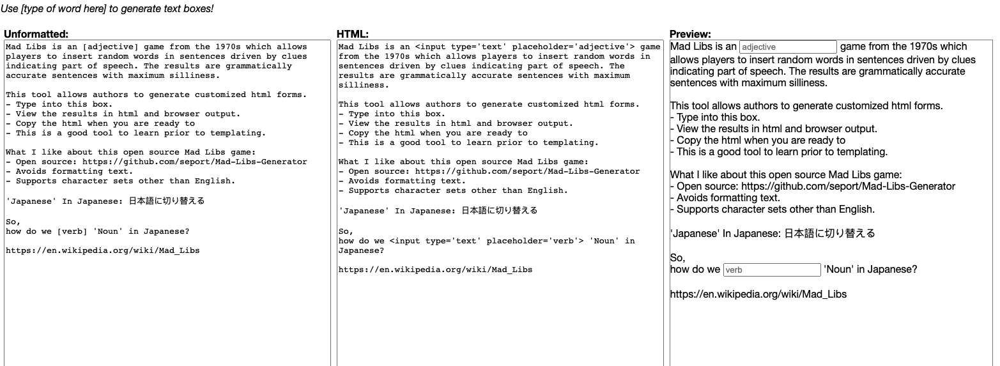

## Mad Libs Generator



- This Simple Multilingual Mad Libs HTML Generator is supported here for public use.
  - As we type into the left-side text box, the two other text boxes display html text and browser previews, all generated on-the-fly.
  - Type the part of speech that should fill a blank field, wrapped by hard brackets, like so:
    ```
    [adjective]
    ```
  - Once we are ready, we can copy html source code from the middle column.
  - Then we can paste that into empty doc.html for further doc formatting.
  - Look at the sample .txt and .html files under .examples/test-content/ for further guidance.
  - Support is provided to those who wish to contribute to our catalog.

---

#### Table Of Contents
- [Getting Started](#getting-started)
- [Audiences](#audiences)
- [Proposed Top Level Site Map For Support Docs](#proposed-top-level-site-map-for-support-docs)

---

#### Getting Started
- Mad Libs Generator App Users Test [Demo App](https://urbanspectra-nyc.github.io/Mad-Libs-Generator/code/) With Provided Example of [Test Content](catalog/test-content/test-content.txt).
- To Create Nice Web Page, Follow Provided Example of [Formatted HTML Test Content](catalog/test-content/test-content.html).
- Mad Libs Generator App User Support Requests
- Browse Our Multilingual Mad Lib Catalog
- Contribute Content To Our Multilingual Mad Lib Catalog
- Translate Multilingual Mad Lib Catalog Contents
- In concert with other educators, we explore opportunities that vocabulary clues can provide for teaching and learning.
- Templating will be useful here.  So will multilingual diagramming.

#### Audiences
- Public App Users
- Public Content Contributors
- Student-Lead Teams
- Instructor-Lead Teams
- Faculty-Lead Teams

#### Proposed Top Level Site Map For Support Docs
- .README.md => Keep this simplest for public web app user support.
- [Documentation Tree](docs/)
  - [Edu Docs](docs/edu-docs/)
  - [Tech Docs](docs/tech-docs)
  - [i18n Docs](docs/i18n-docs/)
  - [Diagrams](docs/diagrams/)
---

### Web App Enhancements
- [ ] Deploy app as github page.
- [ ] Complete app user doc.
- [ ] Move doc tree + enhancement to [docs/README](docs/README.md)
- [ ] Make sure virgin contributors are well supported.

