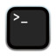

# Mad Libs Generator
This is a simple Mad Libs HTML generator.


## Getting Started

- /Applications/Utilities/Terminal
- To Use In [Terminal](https://en.wikipedia.org/wiki/Terminal_(macOS)) ,
copy each line verbatim AFTER THE DOLLAR SIGN, then paste into terminal and press return:
  - $ cd ; git clone git@github.com:urbanspectra-nyc/Mad-Libs-Generator.git
  - $ cd Mad-Libs-Generator ; open .
  - Open the local index.html file in your browser.
  - Look in /examples/ dir for examples.

- To Contribute As An Educator: What is your github id?
  - $ git fork # Now you have your own copy in your github account.
  - $ cd ; git clone git@github.com:[github-id]/Mad-Libs-Generator.git ; open .
  - $ cd Mad-Libs-Generator
  - $ mkdir -p /examples/[github-id]/; cd $_
  - $ git branch # Branch naming standards.
  - Paste example ascii and html test files here.
  - $ cd .. ; git status ; git add . ; git commit -m 'Added some content.' ; git log # q to exit log
  - $ git push # Now go to your fork and see how to make a pull request.

- To Contribute As Project Tech Team Member:
  - $ cd ; git clone git@github.com:urbanspectra-nyc/Mad-Libs-Generator.git ; open .
  - $ cd Mad-Libs-Generator
  - $ mkdir -p /examples/[github-id]/; cd $_
  - $ git branch # Branch naming standards.
  - Change code here.
  - $ cd .. ; git status ; git add . ; git commit -m 'Added some code.' ; git log # q to exit log
  - $ git push


### Generating Mad Libs
To use the mad libs generator, type your story into the leftmost text area. To insert a textarea, type the part of speech it should be surrounded by hard brackets, like so:

```
[adjective]
```

A preview will appear as you type on the right side of the screen, and you can copy and paste the source code from the middle.

Look at the sample .txt and ascii files for further guidance.